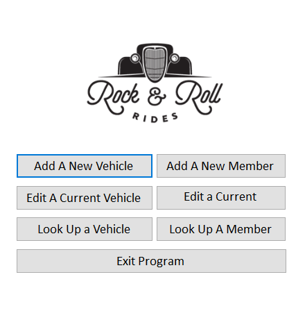
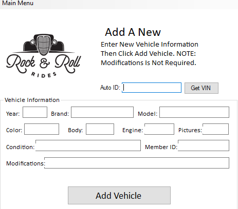

# Rock-and-Roll-Auto-Club

In this file, you will see a project I took part in with a small team to help an auto club organize its data..
This program stores information ifor an Auto club called the Rock and Roll auto club. 
Users were designed to be seen only by employees of this club and possibly some upper managament. 
The users that can see it have two main tables: 
One for the auto club member's information,
And the other one for storing any information on any car they are restoring.
Users can add new users and vehicles.
There is also a feature to search for any user by a unique ID, and any vehicle by a unique VIN number.
No customers or any other potential users are allowed to see it.
My contribution was to help with the potential design and any debugging needed should this program not work correctly.
My partner, Caitlyn Nelson, did most of the heavy lifting by creating most of the logic for the program. 
This project was created in Visual Studio using C# and the .NET framework and the database file was imported from Access.
For a live demonstration of this application, I would request of you that I bring a physical representation of this application on my 
flash drive in case that importing these files from GitHub does not work right.

In these screenshots, you will see the basic design and introduction of this application.

