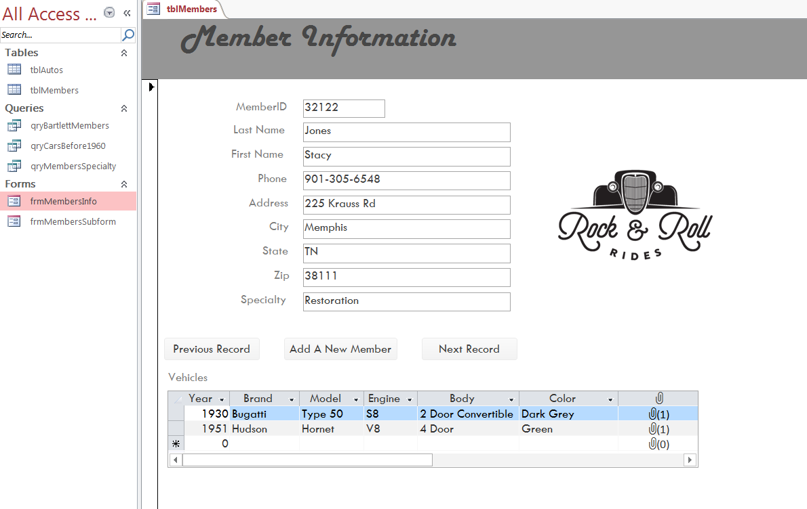

Caitlyn Nelson 
Abinet Deresebachew 
Paul Orion Weaver 
Juan Bell 
Ahmed Alshehir 
Nathaniel Baker 

<strong>Rock and Roll Rides Auto Club</strong>

<strong>NEED</strong>: The auto club needs a database to manage members and their vehicles. Should be user friendly, and provide all information needed to add, edit, or look up individual members and autos. Each member can have one or more vehicles, and a vehicle can be owned by just one member.

<strong>(SDLC Process)</strong>

<strong>ANALYSIS PHASE:</strong>
 User Requirements (Forms, Reports, & Perceptions)
<strong>Input Forms</strong>
frmMemberInfo – to add, edit or look up members
frmMembersSubform – to add, edit, or lookup up autos
<strong>Output Reports</strong>
rptMembers - a list of existing members
rptAuto - a list of existing autos
rptIndvAutos1 - a more detailed list of autos focusing on individual autos

<strong>DESIGN PHASE:</strong>
 Relational Database Design Process Database Structure

<table>
	<tr>
		<th>Table Name</th>
		<th>Field Name (Data type, Field Size)</th>
	</tr>
	<tr>
		<td>tblMembers</td>
		<td>MemberID (Primary Key, Short Text, 50) 
			LastName (Short Text, 50) 
			FirstName (Short Text, 50) 
			Phone (Short Text, 50, with Input Mask) 
			Address (Short Text, 50) 
			City (Short Text, 50) 
			State (Short Text, 50) 
			Zip (Short Text, 50) 
			Specialty (Short Text, 50) 
		</td>
	</tr>
	<tr>
		<td>tblAutos</td>
		<td>AutoID (Primary Key, Short Text, 50) 
			Year (Number [for comparisions], long integer) 
			Brand (Short Text, 50) 
			Model (Short Text, 50) 
			Engine (Short Text, 50) 
			Body (Short Text, 50) 
			Color (Short Text, 50) 
			Condition (Short Text, 50) 
			Modifications (Short Text, 50) 
			Pictures (Attachment) 
			MemberID (Short Text, 50) 
		</td>
	</tr>
</table>

<strong>Relationships:</strong> 
	tblMembers (one to many) tblAutos

<strong>Reports:</strong> 
	rptMembers - a list of existing members 
	rptAuto - a list of existing autos 
	rptIndvAutos1 - a more detailed list of autos focusing on individual autos 
	
<strong>Queries:</strong> 
	qryBartlettMembers – Shows only members location within Bartlett 
	qryCarsAfter1960 – Shows only cars after the year 1960 
	qryCarsBefore1960 – Shows only cars dated before 1960 
	qryMembersSpecialty – Shows only members with a specialty  
	qryModifications – Shows only autos with modifications 

<strong>Prototype:</strong>  

